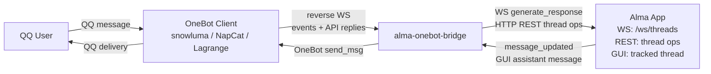

# Alma × OneBot v11 Reverse WebSocket Bridge

Build a Rust service that bridges Alma with QQ (or any OneBot v11 IM) via a reverse WebSocket architecture. The bridge is a WS **server** for the OneBot client and a WS **client** for Alma's internal chat pipeline, translating between the two protocols, correlating API calls via the `echo` field, and persisting state across restarts.

## Architecture



The bridge sits between two WebSocket connections: one from the OneBot client (reverse WS mode) and one to Alma's internal thread pipeline. The OneBot-facing side speaks `trillium_websockets`; the Alma-facing side speaks `async_tungstenite`. Their message types must never be mixed.

## Prerequisites

- Rust toolchain — edition 2024 (Rust 1.85+)
- Alma running locally — confirm with `alma status`
- An OneBot v11 client configured for reverse WS — snowluma, NapCat, or Lagrange

## References — Read These When the Task Calls for Them

The main file stays focused on the moving parts. Detailed material lives next to it:

- `references/module-layout.md` — full `src/` tree and the locked Cargo.toml manifest
- `references/configuration.md` — every TOML key, load order, SIGHUP hot reload, env vars
- `references/streaming-behavior.md` — Alma stream consumption, stage messaging, tool-call status, dedup, segmented replies
- `references/desktop-packaging.md` — macOS menu bar app, Windows tray app, PKG/MSI/ZIP packaging invariants
- `references/alma-ws-protocol.md` — Alma `/ws/threads` event sequence, message parts, model priority chain
- `references/pitfalls.md` — the 16 highest-cost issues encountered while building the bridge

## Step 1 — Project Init

Create a Rust project with edition 2024 and the smol + Trillium stack. The full `Cargo.toml` lives in `references/module-layout.md`. The hard rules:

- The bridge ships a self-contained smol + Trillium stack. Do **not** add direct `tokio`, `warp`, `reqwest`, `tokio-tungstenite`, `tokio-stream`, `async-h1`, or `http-types` dependencies — they would split the runtime and corrupt scheduling assumptions.
- Use `trillium_smol::SmolRuntime`, `smol::unblock`, `trillium-client`, and `trillium-rustls` directly. Do not wrap them in local runtime/client modules.
- `server.rs` is route composition only, not a hand-written HTTP/WebSocket implementation.

## Step 2 — Module Layout

The source tree (full annotations in `references/module-layout.md`):

```
src/
  main.rs        entry point: smol::block_on(async_main())
  lib.rs         bootstrap, tracing, debugger mode, PID file, SIGHUP, log rotation
  config.rs      TOML config loading
  state.rs       SharedState + Turso persistence
  auth.rs        Bearer/loopback authorization for WS and HTTP command endpoints
  server.rs      Trillium router + HTTP endpoints + OneBot WS upgrade
  handlers/
    mod.rs       re-exports
    http.rs      GET /health, GET /qq/groups, POST /qq/{group,private}/<id>/send
    ws.rs        reverse WS lifecycle, event dispatch, writer task
  onebot/
    mod.rs       re-exports
    event.rs     OneBot v11 serde, text extraction, @bot detection, reply parsing
    api.rs       echo-based WS API calls, PendingCalls, send_text_message
  face_map.rs    QQ face expression ID ↔ Chinese name
  group_log.rs   ~/.config/alma/groups/<id>_<date>.log writer, README marked section
  alma.rs        Alma REST: create_thread, fetch_default_model
  alma_ws.rs     Alma WS client: generate_response, per-thread generation guards
  pipeline.rs    end-to-end message processing, bidirectional forwarding
  people.rs      ~/.config/alma/people/<qq_id>.md auto-creation
```

## Step 3 — Trillium HTTP/WebSocket Server

Use Trillium for the OneBot-facing HTTP/WebSocket server. Different OneBot clients default to different paths, so listen on all three: `/`, `/ws`, and `/onebot/v11/ws`.

`server.rs` exposes:

- `GET /health` — readiness probe
- `GET /qq/groups` — list known QQ groups + OneBot connection status
- `POST /qq/group/<group_id>/send` — actively send a group message
- `POST /qq/private/<user_id>/send` — actively send a private message
- WebSocket upgrades for the three paths above

Use `trillium_smol::config().with_host("0.0.0.0").with_port(port).without_signals()` with a `trillium_smol::Swansong` driven by the bridge shutdown signal. For WS authentication, read headers and query parameters from `trillium_websockets::WebSocketConn` and run them through `auth::is_ws_authorized` before registering the connection.

## Step 4 — WebSocket Split Pattern

`WebSocketConn` owns both halves of the socket; you cannot share it across tasks directly. The pattern is to take the inbound stream and keep the connection inside a dedicated writer task driven by an unbounded channel.

```rust
let Some(mut inbound) = ws.take_inbound_stream() else { return; };
let (ws_tx, ws_rx) = smol::channel::unbounded::<trillium_websockets::Message>();

trillium_smol::SmolRuntime::default().spawn(async move {
    let mut socket = ws;
    while let Ok(msg) = ws_rx.recv().await {
        if socket.send(msg).await.is_err() {
            break;
        }
    }
});

while let Some(message) = inbound.next().await {
    // API response or event dispatch
}
```

`ws_tx` is `Clone`, so any task can send through it. The Alma outbound client uses `async_tungstenite` — keep its `Message` type out of code paths that handle `trillium_websockets::Message`.

## Step 5 — Echo Correlation

Events and API responses share the same WebSocket. The `echo` field disambiguates them:

- Message has `echo` + `retcode` → API response → look up in `PendingCalls`, resolve the awaiting channel.
- Message has `post_type` → event → dispatch to handlers.

```rust
pub async fn call_api(
    ws_tx: &smol::channel::Sender<Message>,
    pending: &PendingCalls,
    action: &str,
    params: serde_json::Value,
    timeout_secs: u64,
) -> Result<ApiResponse, String> {
    let echo = format!("bridge-{}-{}", uuid::Uuid::new_v4(), action);
    let (resp_tx, resp_rx) = smol::channel::bounded(1);
    pending.0.lock().await.insert(echo.clone(), resp_tx);

    let request = ApiRequest { action: action.to_string(), params, echo: echo.clone() };
    ws_tx.send(Message::Text(serde_json::to_string(&request)?.into())).await?;

    let result = trillium_smol::SmolRuntime::default()
        .timeout(Duration::from_secs(timeout_secs), resp_rx.recv()).await;
    pending.0.lock().await.remove(&echo);
    // ... resolve result
}
```

This enables multiple concurrent API calls on a single WS connection. Treat responses with `retcode != 0` **or** `status != "ok"` as errors — `data.message_id` alone is not a success signal.

## Step 6 — OneBot v11 Event Handling

Parse incoming WS messages as `OneBotEvent`. Spawn a task for each message event so the reader loop is never blocked on AI generation.

Key behaviours:

- Group messages require `@bot`. Strip the mention before passing the text to Alma.
- Use array-format message segments (`[{"type":"text","data":{"text":"..."}}]`). The CQ string format is legacy.
- Extract visible text by concatenating all `type: "text"` segments. Tag images/voice/video so Alma sees structured context.
- Prefer `sender.card` (the group card) over `sender.nickname` for the display name in group chats.
- Decode QQ face IDs via `face_map.rs` to `[emoji:<name>]`; fall back to `[emoji:face_<id>]` for unknown IDs.
- Extract reply context: when an incoming message has a `reply` segment, call `get_msg` to fetch the quoted text and format `[Replying to X's message: "..."]`.

## Step 7 — Alma Integration

Use the Alma WebSocket protocol directly. This is what gives the bridge full access to SOUL, Memory, People Profiles, and Skills — the `alma run` CLI is a fallback only.

Thread creation goes through REST:

```
POST http://localhost:23001/api/threads
Body: {"title": "QQ Group 100200300"}
Response: {"id": "<thread_id>"}
```

AI generation goes through WS:

```json
{
  "type": "generate_response",
  "data": {
    "threadId": "<thread_id>",
    "model": "anthropic:claude-sonnet-4-20250514",
    "userMessage": {
      "role": "user",
      "parts": [{"type": "text", "text": "user message"}]
    },
    "source": "telegram-group",
    "ephemeralContext": "<assembled per-turn context>"
  }
}
```

Use `source = "telegram-group"` for QQ group messages and `source = "telegram"` for private messages. The bridge spoofs Telegram so that Alma's downstream channel processing (history stripping, group rules) keeps working.

**The streaming consumption rules — stage messages, tool-call status, dedup, segmented replies — are subtle. Read `references/streaming-behavior.md` before touching `alma_ws.rs` or `pipeline.rs`.** Headline facts:

- Stage messages: when a `part_add` introduces a tool invocation, send the visible text accumulated before the tool call as a stage message. The `generation_completed` / `thread_generating=false` pair that follows is **not** the end — wait for the continuation.
- Per-thread generation guards: serialize concurrent `generate()` calls per thread.
- Dedup: compare normalized visible assistant text against the last ~20 sent replies per thread.
- Idle timeout: `alma.timeout` resets after each stage/tool progress event.

**Do not open or write Alma's `chat_threads.db` from this external bridge.** Alma keeps the file locked while running, and cross-process access fails with "File is locked by another process". Keep QQ session-to-thread state in the bridge's local Turso DB; create threads through Alma REST.

For the full Alma WS event sequence, see `references/alma-ws-protocol.md`.

## Step 8 — Message Pipeline

The end-to-end flow for each inbound QQ message:

1. Extract visible text from message segments.
2. For group messages, append to the in-memory ring buffer and `~/.config/alma/groups/<group_id>_<date>.log` **before** the `@bot` gate. Logs are written even when the bridge is not configured to reply, so Alma's `alma group history/search/context` tools keep working.
3. Ensure a People Profile exists for the sender.
4. Look up the Alma thread in the bridge's `threads` table; if missing, create it via Alma REST.
5. Format the message:
   - group: `[From: 萌依 [id:1757176294] [msg:42]] message text`
   - private: `[msg:42] message text`
   - reply: prepend `[Replying to X's message: "..."]`
6. Send `generate_response` over Alma WS, await streamed response.
7. Emit stage messages at tool boundaries (see `references/streaming-behavior.md`).
8. Send the final remaining text via OneBot `send_msg`. By default keep it as one message; only chunk on the ~4500 char limit.
9. If `chat.segmented_replies=true`, split each stage/final text by paragraphs (`\n\n`) before length chunking.
10. Register sent replies for dedup and append Alma's group replies to `~/.config/alma/groups`.

The HTTP command endpoints (`/qq/group/<id>/send`, `/qq/private/<id>/send`) accept an optional `reply_to_id` and `at_user_id` so Alma tools can target a specific message. Loopback callers bypass token auth; non-loopback callers must present `Authorization: Bearer <onebot.access_token>` or `?token=...`.

`~/.config/alma/groups/README.md` carries an `<!-- alma-onebot-bridge:start -->` ... `<!-- alma-onebot-bridge:end -->` marked section. The bridge only touches content between those markers; everything outside stays intact. The marked section is a group directory — do not embed per-user identity there. Group cards belong in People Profiles.

## Step 9 — Bidirectional Forwarding

Messages typed in the Alma GUI for a tracked thread are forwarded to QQ.

```
Alma WS reader → internal channel → 500ms drain → broadcast channel
  → OneBot handler → dedup → OneBot send_msg → QQ
```

Two pitfalls dominate this path:

- Use `message_updated`, **not** `message_added`. `message_added` always fires with empty text for assistant messages because the shell is created before deltas arrive.
- Filter by generation state. `message_updated` fires many times during a generation; only the post-`thread_generating=false` event carries the final text. Track generating threads in a `HashSet<String>`.

Dedup normalization handles HTML breaks, whitespace, thinking blocks, and system reminder boilerplate, then runs a bidirectional prefix match (`sent.starts_with(prefix) || prefix.starts_with(sent_prefix)`). Distinct messages with a shared long prefix are not mistaken for duplicates.

## Step 10 — State Persistence (Turso)

Local SQLite-compatible Turso DB holds the four tables below. Reverse lookup (`thread_id → session_key`) is held in memory and rebuilt lazily on `get_thread_id`/`set_thread_id`.

```sql
CREATE TABLE threads (
    session_key TEXT PRIMARY KEY,   -- "private:123456789" | "group:100200300"
    thread_id   TEXT NOT NULL
);
CREATE TABLE profiles (
    user_id      TEXT PRIMARY KEY,
    profile_name TEXT NOT NULL
);
CREATE TABLE groups (
    group_id    TEXT PRIMARY KEY,
    title       TEXT NOT NULL DEFAULT '',
    last_active TEXT NOT NULL DEFAULT '0'
);
CREATE TABLE group_members (
    group_id     TEXT NOT NULL,
    user_id      TEXT NOT NULL,
    display_name TEXT NOT NULL,
    last_seen    TEXT NOT NULL DEFAULT '0',
    PRIMARY KEY (group_id, user_id)
);
```

Turso's `Statement::query()` / `Statement::execute()` take `&mut self`. Prepared statements must be declared `mut`.

## Step 11 — People Profile Auto-Creation

Create `~/.config/alma/people/<qq_id>.md` for new senders. The frontmatter must keep `telegram_id` and `qq_id` set to the same QQ ID so Alma's downstream channel logic (which is keyed on `telegram_id`) keeps matching.

```markdown
---
telegram_id: "1757176294"
qq_id: "1757176294"
username: "Alice"
---
# Alice
- QQ user, ID: 1757176294
- Nickname: Alice
- First interaction: 2026-06-19
- 群名片:
  - 706968284: 群内昵称
```

Use `username` (not `qq_nickname`) to match Alma's standard field naming. Per-group cards live under `- 群名片:` in this file. Do **not** duplicate group members inside `~/.config/alma/groups/README.md`.

## Step 12 — Configuration

Bridge configuration is TOML; environment variables are reserved for runtime metadata (log paths, debugger flag). The complete key reference, load order, SIGHUP hot-reload rules, and env vars are in `references/configuration.md`. Most-touched keys:

- `bridge.port` — default `8090` (not `8080`; that's commonly occupied by Docker/nginx-ui).
- `alma.api`, `alma.model`, `alma.timeout` — `timeout` is an idle timeout, not wall clock; it resets after each progress event.
- `onebot.access_token` — required for non-loopback HTTP command endpoints and incoming reverse WS.
- `chat.listen_group_messages` / `chat.respond_to_group_messages` — observation and response can be toggled independently.

The bridge supports SIGHUP hot reload on Unix for most keys; `bridge.port` and `database.path` need a full restart.

## Step 13 — Container Networking

When the OneBot client runs in a container (OrbStack, Docker), the host is reachable via `host.docker.internal`. The container bridge network cannot directly reach LAN devices.

snowluma example (`onebot_<qq_id>.json`):

```json
{
  "networks": {
    "wsClients": [{
      "name": "Alma",
      "url": "ws://host.docker.internal:8090/ws",
      "messageFormat": "array",
      "reportSelfMessage": false,
      "role": "Universal",
      "reconnectIntervalMs": 5000
    }]
  }
}
```

## Step 14 — Desktop Apps

The repository ships a SwiftUI menu bar app (`platforms/macos/`), a Rust + WinUI tray app (`platforms/windows/`), and release scripts under `scripts/`. The Windows tray runs the bridge **in-process** on `smol::block_on`, so any Tokio-rooted dependency dragged into `platforms/windows/src/app_state.rs` would deadlock.

Build commands:

```bash
./scripts/build-macos.sh                    # macOS .app
./scripts/package-macos-pkg.sh              # macOS PKG installer
.\scripts\package-windows-velopack.ps1      # Windows Velopack MSI
.\scripts\package-windows-zip.ps1           # Windows portable ZIP
```

Packaging invariants — PKG payload layout, icon wiring (`AppIcon.icns` via `CFBundleIconFile`, never `CFBundleIconName`), tag immutability, GitHub Actions Node 24 alignment, localization rules — are in `references/desktop-packaging.md`. Treat that file as authoritative when touching any release pipeline.

## Common Pitfalls

Headline list. Each entry expands in `references/pitfalls.md`.

1. Do not reintroduce Tokio/Warp/reqwest/async-h1/http-types — Trillium owns the server stack.
2. `message_added` has empty assistant text — use `message_updated`.
3. `message_updated` fires multiple times — filter by generation state.
4. `turso::Statement` needs `&mut self` before `query` / `execute`.
5. No REST endpoint for sending messages — use the Alma WS `generate_response` protocol.
6. `WebSocketConn` is owned by the writer task; other tasks send through `smol::channel`.
7. Concurrent `generate()` for the same thread corrupts the pending map — use per-thread guards.
8. Stage text is default Telegram-compatible behaviour; `chat.segmented_replies` is presentation-only.
9. QQ ~4500-char limit always triggers chunking; paragraph splitting only when `segmented_replies=true`.
10. macOS PKG payload must be staged with `Applications/AlmaOneBotBridge.app` and `install-location="/"`.
11. macOS icon must use `CFBundleIconFile=AppIcon.icns`, not asset-catalog `CFBundleIconName`.
12. Never move a release tag — bump the version and push a new tag instead.
13. Keep GitHub Actions on Node-24-compatible majors; do not silence Node deprecation warnings.
14. Do **not** open `chat_threads.db` from this external bridge — it is locked while Alma runs.

## Verification

After changes, run the matching subset:

```bash
cargo test                                       # bridge logic
cargo build --release                            # full release build
cargo check --manifest-path platforms/windows/Cargo.toml   # if Windows app touched
bash -n scripts/build-macos.sh scripts/package-macos-pkg.sh   # if shell scripts touched
```

For macOS packaging changes, build a local Apple Silicon PKG and inspect the payload:

```bash
BUILD_UNIVERSAL=0 TARGET=aarch64-apple-darwin PACKAGE_ARCH=arm64 \
  ./scripts/package-macos-pkg.sh
pkgutil --expand-full dist/macos/AlmaOneBotBridge-*.pkg /tmp/pkg-check
ls /tmp/pkg-check/Payload/Applications/AlmaOneBotBridge.app/Contents/MacOS
```

End-to-end smoke test:

1. Start Alma, then the bridge, then the OneBot client — in that order.
2. `curl http://localhost:8090/health` returns 200.
3. Send a QQ private message; receive an AI reply.
4. Send a QQ group message with `@bot`; receive an AI reply.
5. Type in the Alma GUI for a tracked thread; verify forwarding to QQ.
6. Restart the bridge; verify that thread mappings persist and no duplicate threads are created.
